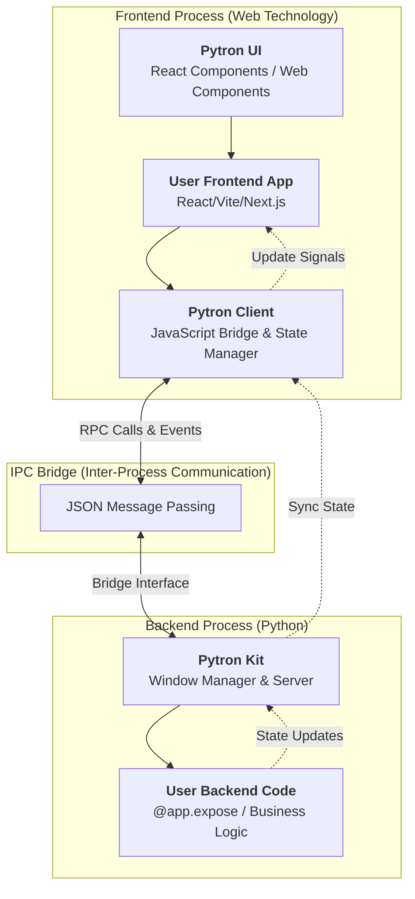

# Pytron Architecture

This document outlines the architectural decisions, technology stack, and inner workings of the Pytron framework.

## Framework Workings

The following diagram illustrates how Pytron bridges Python and Web Technologies:

## Polyglot Stack

Pytron is a polyglot framework that leverages the best tools for each layer:

*   **Python**: The core of the framework (90%+). Handles the CLI, window management, and business logic.
*   **JavaScript / TypeScript**: Powers the frontend bridge (`pytron-client`), UI components (`pytron-ui`), and template scaffolding.
*   **Rust**: Provides the high-security "Agentic Shield" bootloader and payload encryption layer.
*   **C / C++**: Low-level OS integration (Win32, GTK, Cocoa), Android JNI bridge, and Nuitka-compiled machine code.
*   **Kotlin / Java**: Android-specific lifecycle management and native platform hooks.
*   **HTML / CSS**: The backbone of all user interfaces and frontend layouts.
*   **Shell / PowerShell**: Orchestrates multi-platform automation, environment initialization, and CI/CD workflows.

## Architecture & Technology Decisions

Pytron uses a curated stack of robust open-source technologies to power its features. We explicitly acknowledge and explain our architectural choices below:

-   **Chrome Engine (Mojo)**: We integrate **[Electron](https://www.electronjs.org/)** as our high-performance rendering engine. We use a "headless" approach where Electron handles the view layer (Chromium), while all business logic remains in your Python process. This provides modern CSS support and DevTools without the complexity of a full Node.js backend.
-   **Native Engine**: For lightweight, zero-dependency apps, we use a custom implementation **inspired by [pywebview](https://github.com/r0x0r/pywebview)**. We rebuilt the core loop to support our VAP (Virtual Asset Provider) and deeper platform-specific integration (Win32/Cocoa/GTK) and a more NPM based frontend where python avoids direct injection of JS code and avoids direct interaction with the DOM.
-   **Security Layer**: The "Agentic Shield" secure bootloader is written in **[Rust](https://www.rust-lang.org/)**. We chose Rust for its memory safety and ability to securely handle AES-256-GCM decryption keys in memory, preventing typical Python bytecode extraction attacks.
-   **Packaging**:
    -   **[PyInstaller](https://pyinstaller.org/)**: The default choices for `pytron package` due to its excellent compatibility with complex scientific libraries (NumPy, Torch).
    -   **[Nuitka](https://nuitka.net/)**: Available via `--nuitka`. We support this for developers needing compilation to machine code (C++) for performance-critical applications.
-   **Frontend Tooling**: Our CLI scaffolds projects using **[Vite](https://vitejs.dev/)**. We customized the Vite config to proxy requests to our Python backend, enabling a seamless "Hot Module Replacement" experience for dual-stack development.

## Build & Security Pipeline

Pytron introduces a sophisticated build pipeline designed to secure Python applications and ensure reliable dependency resolution.

### Crystal Audit
Traditional Python packagers often struggle with hidden imports, dynamic loading, and complex dependency trees. **Crystal Audit** is Pytron's answer to this challenge.
*   **PEP 578 Surveillance**: Crystal Audit launches your application in a controlled environment and attaches a system audit hook (`sys.addaudithook`) to capture every import event as it happens in real-time.
*   **Defanged Execution**: To safely analyze side-effects without damaging your system, Crystal "defangs" destructive operations (like `os.remove`, `subprocess.run`, `socket`) by replacing them with aggressive mocks during the audit.
*   **Recursive Analysis**: It inspects exposed functions and classes, recursively traversing closures and bytecode to find hidden dependencies that static analysis misses.
*   **Precision Manifest**: The result is a `requirements.lock.json` that lists exactly which modules and files were accessed, ensuring a 100% accurate build with zero bloat.

### Secure Pipeline (Agentic Shield)
For enterprise and commercial applications, protecting source code is paramount. The **Secure Pipeline** ensures that your Python logic is not exposed as easily decompilable bytecode.
*   **Binary Compilation**: The main entry point and critical modules are compiled to native machine code (`.pyd` / `.so`) using **Cython**. This prevents trivial decompilation (like `uncompyle6`) and requires reverse engineering tools to analyze.
*   **Native Bootloader**: A custom Rust-based bootloader ("Agentic Shield") initializes the environment and launches the compiled application, providing a secure native entry point.
*   **Library Fusion**: Functionality to bundle distributed Python modules into a single `app.bundle` structure, reducing file clutter and obscuring the standard `_internal` directory layout.
*   **Integrity Checks**: The pipeline ensures that the compiled components are correctly linked and loaded, preventing basic tampering.
