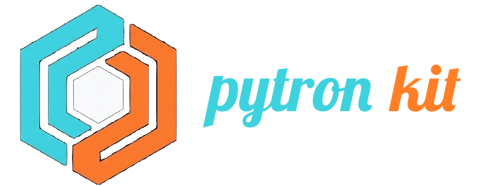

# Pytron Kit

> **Stop wrapping AI in boring API calls and web tabs. Turn Python scripts into full-fledged desktop applications.**

[](https://pytron-kit.github.io)
[](https://pypi.org/project/pytron-kit/)
[](https://discord.gg/m7J6ddwSs)
[](LICENSE)

---

## The Vision: Python is the Controller, JS is the UI

Python is the undisputed heart of AI, ML, and data processing — PyTorch, Ollama, Transformers, LangChain, Whisper, and OpenCV all live here. But traditionally, building desktop apps forced developers to make **Node/JavaScript the main process** while Python got demoted to an awkward "sidecar" subprocess.

**Pytron Kit inverts the architecture:**

* **Python is the Native Controller**: Manages state, OS integrations, daemons, file systems, and heavy AI hardware directly.
* **JavaScript is the UI Controller**: Renders beautiful, ultra-responsive web UIs (React, Vite, Next.js, Vue, Tailwind).

Instead of locking AI inside terminal scripts or browser tabs tied to `requests.post()`, Pytron is the ultimate **Python-to-App Enabler** — giving your Python logic native desktop superpowers, zero-latency IPC, and automatic TypeScript definitions.

---

## Why Pytron Kit?

* **Built for AI & Python Workflows**: Offload heavy Python models (Ollama, PyTorch, Whisper) to background thread pools effortlessly. Your UI stays smooth at 60 FPS while Python works.
* **Native or Chrome/Electron Engines**: Use lightweight native OS WebViews by default, or run `pytron run --chrome` / `pytron package --chrome` to bundle Electron/Chromium for 100% cross-platform UI consistency!
* **Type-Safe Magic**: Decorated Python functions auto-generate frontend TypeScript definitions (`.d.ts`). Calling Python from JS feels like calling a local function with full autocompletion!
* **Dual Hot-Reloading**: Save frontend code -> Vite HMR updates UI instantly. Save Python backend code -> Pytron hot-restarts the backend automatically.
* **Full Desktop Superpowers**: Daemons, system notifications, taskbar progress, dock badges, native file dialogs, system tray icons, and global shortcuts out of the box.
* **One-Command Standalone Executables**: Ready to distribute? `pytron package` bundles your Python controller and web frontend into a compact binary (`.exe`, macOS app, Linux binary).

---

## Show Me the Code: Build a Native AI Assistant in Seconds

### 1. Python Backend (`main.py`)
```python
from pytron import App
from pydantic import BaseModel

app = App()

class Query(BaseModel):
    prompt: str

@app.expose
def ask_ai(query: Query) -> str:
    # Run local Ollama, PyTorch model, or agentic loop here!
    return f"AI Thinking on: {query.prompt}"

app.generate_types() # Auto-generates frontend/src/pytron.d.ts
app.run()
```

### 2. Frontend React / TypeScript (`App.tsx`)
```typescript
import pytron from 'pytron-client';
import { useState } from 'react';

export function App() {
  const [response, setResponse] = useState('');

  async function handleAsk() {
    // Fully typed autocomplete for your Python methods!
    const answer = await pytron.ask_ai({ prompt: "Analyze local desktop files" });
    setResponse(answer);
  }

  return (
    <button onClick={handleAsk}>
      {response || "Run AI Agent"}
    </button>
  );
}
```

---

## Quick Start

### 1. Install Pytron Kit
```bash
# Windows
pip install pytron-kit

# Linux / macOS (Recommended via pipx)
pipx install pytron-kit
```

### 2. Initialize Your App
Create a new app with your choice of frontend framework:
```bash
pytron init my_ai_app --template react
```
*(Supported templates: `react` (default), `next`, `vue`, `svelte`, `preact`, `solid`, `lit`, `qwik`, `vanilla`)*

### 3. Install & Run in Dev Mode
```bash
cd my_ai_app
pytron install

# Run with native OS webview
pytron run --dev

# Or run with Electron / Chrome engine
pytron run --dev --chrome
```

---

## Platform Superpowers & Cross-Platform Support

* **Engine Flexibility**: Switch between native webview engines or Electron (`--chrome`) seamlessly during dev and packaging.
* **Daemon & System Integration**: Run in background mode, show/hide windows programmatically, emit cross-platform native OS notifications.
* **Taskbar & Dock Controls**: Set taskbar progress bars, update app icons, and control macOS Dock badges.
* **Native Dialogs**: Use native OS file dialogs (open, save, folder select) and message boxes without third-party popups.
* **Linux Schism Guard**: Built-in GTK3 & WebKit2GTK isolation prevents GLib crashes automatically on Linux distros (Ubuntu 22.04 / 24.04+).

---

## Packaging & Distribution

Ready to ship your app to users? Distribute it as a standalone desktop binary:
```bash
# Package with Native Webview
pytron package

# Package with Chrome / Electron engine
pytron package --chrome
```
Pytron handles current working directory safety (so app data writes cleanly to `%APPDATA%` or user configs without permission errors), splash screens (`--splash`), and bundle optimization.

---

## CLI Reference

* `pytron init <name> [--template <template>]` — Scaffold a new Pytron app.
* `pytron install` — Smartly manage Python dependencies in a project virtual environment (`env/`).
* `pytron run [--dev] [--chrome]` — Launch your app with dual hot-reloading (optionally with Chrome/Electron engine).
* `pytron frontend install <pkg>` — Auto-install frontend npm dependencies.
* `pytron package [--chrome]` — Build a standalone desktop executable (Native or Chrome/Electron).
* `pytron show` — List installed environment packages.

---

## Community & Support

Join the Pytron developer community on Discord! Whether you're building local AI agents, sleek utility tools, or native desktop dashboards:

**[Join the Discord Server](https://discord.gg/m7J6ddwSs)**

* Get help and debug issues
* Showcase what you're building
* Suggest features and shape the roadmap

---

## Documentation & Resources

Explore the detailed documentation and community resources:

* **[Official Website](https://pytron-kit.github.io)** — Official documentation, tutorials, and guides.
* **[Usage Guide](USAGE.md)** — Comprehensive usage patterns, state management, and API examples.
* **[Architecture Overview](ARCHITECTURE.md)** — Deep dive into Pytron's native IPC, engine adapters, and process isolation.
* **[Project Roadmap](ROADMAP.md)** — Upcoming features, vision, and release milestones.
* **[Contributing Guide](CONTRIBUTING.md)** — Guidelines for contributing, local setup, and pull requests.
* **[Credits & Acknowledgements](CREDITS.md)** — Core contributors, open-source libraries, and technology inspirations.
* **[Changelog](CHANGELOG.md)** — Version history and release notes.
* **[Support Guide](SUPPORT.md)** — Troubleshooting tips and community support channels.
* **[Security Policy](SECURITY.md)** — Security guidelines and vulnerability reporting.
* **[Code of Conduct](CODE_OF_CONDUCT.md)** — Community standards and principles.
* **[License](LICENSE)** — MIT License details.

---

Happy building with **Pytron Kit**!


