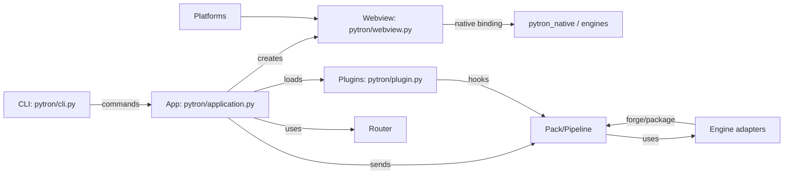

Pytron-Kit Architecture (concise)

Summary
- Pytron is a Python app framework that wraps a native webview engine, a build/pack toolchain, and a plugin system to produce cross-platform desktop (and mobile) apps.
- Main runtime pieces: CLI, App runtime, Webview bridge (native engine), Platform shims, Packaging/pack pipeline, Engines (native, chrome, etc.), and Plugins.

Primary components
- Core runtime: App lifecycle, state, codegen
  - Key file: [pytron/application.py](pytron/application.py)
- CLI: user-facing commands that drive run/package/engine tasks
  - Key file: [pytron/cli.py](pytron/cli.py)
- Webview bridge: Native engine integration and IPC bindings
  - Key file: [pytron/webview.py](pytron/webview.py)
- Router & Deep links: URL pattern matching to internal handlers
  - Key file: [pytron/router.py](pytron/router.py)
- Plugin system: discover, load, supervise, and invoke plugin hooks
  - Key file: [pytron/plugin.py](pytron/plugin.py)
- Platforms: OS-specific helpers and ops (windows, darwin, linux, android)
  - Folder: [pytron/platforms](pytron/platforms)
- Pack/build pipeline: modular build pipeline and packers (PyInstaller, Nuitka, Rust helpers)
  - Key file: [pytron/pack/pipeline.py](pytron/pack/pipeline.py)
- Engines: browser/webview engines and adapters (native, chrome, servo)
  - Folder: [pytron/engines](pytron/engines)

Runtime flow (high level)
1. User runs `pytron` CLI ([pytron/cli.py](pytron/cli.py)) which dispatches subcommands.
2. `run` or packaged exe initializes `App` (`pytron/application.py`) which:
   - sets up logging, config, storage, crash handler
   - creates a `Router` for deep links
   - loads plugins from configured dirs
   - selects engine and prepares `Webview` instances
3. `Webview` (`pytron/webview.py`) creates the native webview binding (via `pytron_native`) and registers IPC bindings:
   - JS -> Python calls are marshalled by the native engine and routed to exposed Python functions
   - App uses `expose()` to make host APIs available to JS
4. Platform shims provide OS-specific features (tray, native dialogs, window flags).
5. Plugins are discovered and loaded by `Plugin` (`pytron/plugin.py`) and may register APIs, add packaging hooks, or provide UI code.

Packaging / Build flow
- Packaging is implemented as a pipeline of modules (`pytron/pack/pipeline.py`).
- `pytron package` composes modules that collect assets, wrap the core build, then run post-build steps (patching, signatures, installers).
- Multiple backends supported: PyInstaller, Nuitka, and Rust-based secure loaders.

IPC & Security
- IPC is synchronous or async depending on binding; native code serializes results via JSON and special binary asset callbacks.
- `expose()` supports marking functions `secure` and `run_in_thread`.
- Packaging supports optional Rust bootloaders/obfuscation (`secure` / `fortress` flags).

Plugin model
- Plugin manifests live as standard `manifest.json` files under a plugin dir.
- Plugins may be loaded in-process or isolated (threaded); they receive a `SupervisedApp` proxy that wraps exposed API calls to prevent plugin crashes from killing the host.
- Plugins can add package-time hooks (`on_package`) and may contain JS UI assets.

Engines & Native bindings
- `pytron_native` (a pyo3 extension) is the main native engine used by `Webview`.
- Engines provide process-level glue for navigation, event loops, and binary asset serving.

Files to inspect for details
- [pytron/application.py](pytron/application.py)
- [pytron/webview.py](pytron/webview.py)
- [pytron/plugin.py](pytron/plugin.py)
- [pytron/pack/pipeline.py](pytron/pack/pipeline.py)
- [pytron/cli.py](pytron/cli.py)
- [pytron/router.py](pytron/router.py)
- [pytron/platforms/android/builder.py](pytron/platforms/android/builder.py)

Mermaid diagram (component map)

